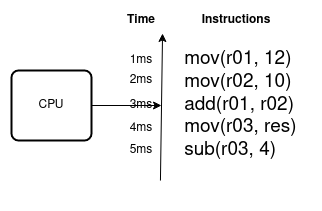
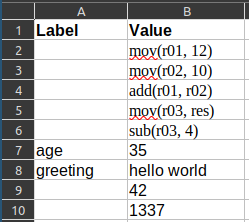

# Freire

## Class 1 - Processor and Memory

In this class we'll learn how the computer's memory and processor work at low level. The goal of this class is
understanding the basics of how a program work, and get involved with the programming language syntax and tools.

Take into account that this section is an oversimplification of how the memory and the processor works. It provides
materials to understand the low level abstraction that is behind all modern programming languages.

### The processor

The processor (CPU from now on) is a device capable of executing instructions sequentially. The _sequential_ nature of
CPUs is the key to understand all modern programming languages. As CPUs can only execute instructions sequentially, the
operating system makes a trick and assigns _processing time_ for different programs. So, the operating system is a
program that shares its own processing time with another programs to give the final user the impression of programs
running in parallel. We as users do not note this trick, because it happens so fast that's not perceptible by human
beings (well, when the computer seems to be _slow_, it is because there are too many programs fighting for processing
time, so we note the trick in certain circumstances).



The speed at which the CPU can carry out instructions is called the clock speed. This is controlled by a clock.
With every tick of the clock, the CPU fetches and executes one instruction. The clock speed is measured in cycles per 
second, and one cycle per second is known as 1 hertz. This means that a CPU with a clock speed of 2 gigahertz (GHz)
can carry out two thousand million (or two billion) cycles per second.

The CPU has an internal memory that we call _registers_. Each _register_ allow storing information required by the
CPU to execute an instruction. The registers are a complement to the main memory. The big difference is that
registers are crazily fast compared to the main memory since they are physically built into the CPU.

In this class we will use both CPU registers and the main memory for writing programs.

### The Memory

The memory is a table, and it's possible to store any kind of data in a single table cell. We usually call _address_
to the row index in the table. Sometimes it's possible to assign a label to an address to use the label instead of
the numeric address.

In the following example, the first column contains the optional label, the second column is the value at the
underlying memory address, and the row number is the numeric memory address.



The CPU reads instructions from the memory. A program consist of a set of instructions, and it ends when the CPU
executes the _END_ instruction. It means a program must provide an _END_ instruction, otherwise the CPU will never stop
reading the memory. In the previous image we could tell the CPU to start executing the program at address 2. The program
is stored in memory from address 2 to 6, and it has no _END_ instruction. So the CPU will execute the instruction at
addresses 2, 3, 4, 5, 6, and as there is no _END_ instruction, the CPU will try to execute the value of address 7,
and it will fail since the memory address 7 has no valid instruction, it's just the value 35.

When we run a program this is exactly what the operating system does. It reads the entire program from disk, then it
loads the program into memory, and finally it tells the CPU to start executing the program at the address it loaded the
program in memory.

The memory also stores any kind of data required by a program. In the previous image we can see there are just random
values from memory address 7 to 10, and two of those values have labels (_age_ and _greeting_). When a program needs
to read values from the memory, it can use either the numeric address or the label. The label has the advantage that
if we move the value to another address, the program will still find it. So modern programs always reference memory by
labels.

### Programs

When we write a program there are some parts we don't need to worry about. For instance, we don't need to load
the program into memory and tell the CPU to start running the program, the operating system does it for us. When
we write a program we have an _entry point_. The _entry point_ is where we start writing the first line of code.

A programming language is a set of instructions easy to understand by human beings, and it helps writing programs
that will be translated to binary code at the end, since the CPU only understands binary code. There are different
programming languages, but we will start with the most basic one: _assembler_ or _asm_. Assembler is a programming
language provided by the CPU manufacturer. It represents the instructions as it's supported by the CPU. So we can
tell Assembler is the most low-level language a human being can use to write a program.

The first exercise does a simple sum and prints the results.

```kotlin
fun main() = entryPoint {
    mov(r01, 12) // Stores value 12 into the r01 register.
    mov(r02, 10) // Stores value 10 into the r02 register.
    add(r01, r02) // Sums the contents of r01 and r02 registers.
    print(res) // The result is stored in the res register, it prints the result.
    end() // Ends the program.
}
```

### The Adventure

Programming can be fun. So we

### Syntax reference

| Character(s)  | Name          | Example        | Description
|---------------|---------------|----------------|--------------
| "             | Double quotes | "hello world"  | Use double quotes to define a String or text.
| {}            | Braces        | fun foo() { }  | Braces must be used to start a new execution unit.
| ()            | Parentheses   | mov(r02, 10)   | Use parentheses to call a function and provide parameters.
| ,             | Comma         | cat(r01, res)  | General purpose separator. Use it to separate parameters.
| 0x            | Zero and x    | 0x123          | Prefix to reference memory addresses.
| //            | double slash  | // a comment   | Use double slashes to write comments. Comments are not executable.
| /*            | slash asterisk| /* a comment */| Multi-line comment.

### Language reference

## Class 2 - Control flow

## Class 3 - Data Types

## Class 4 - Structured programming
